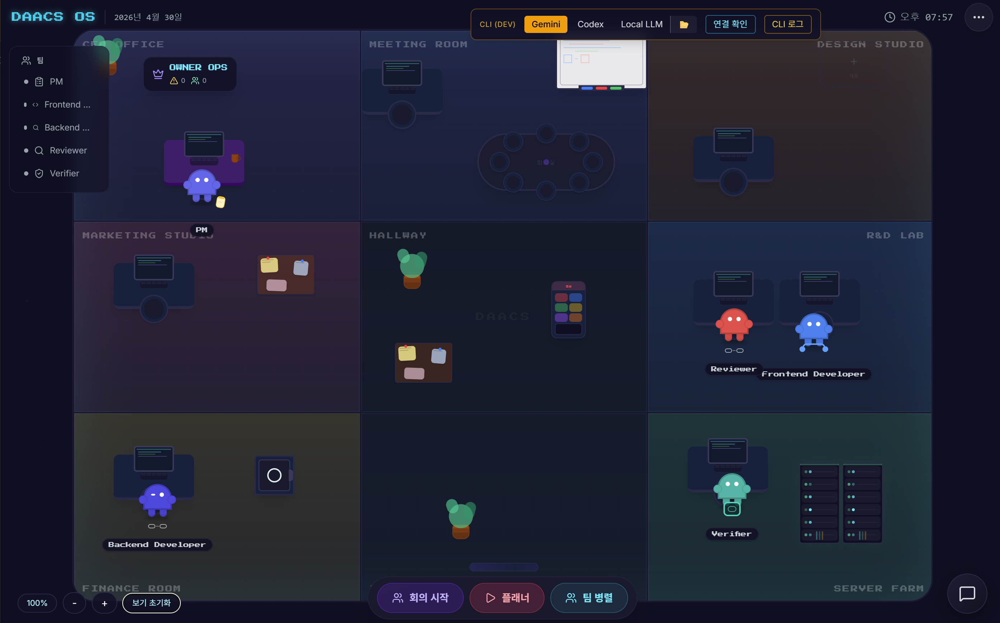

# DAACS OS

<div align="center">

**The operating system for AI-run companies.**

DAACS OS turns natural-language goals into coordinated work performed by AI agents.  
People decide direction. Agents plan, execute, report, ask for approval, and hand work to each other.

[English](README.md) | [한국어](READMEKOR.md)

[](https://www.rust-lang.org/)
[](https://tauri.app/)
[](https://react.dev/)
[](https://www.typescriptlang.org/)
[](https://vite.dev/)
[](#run-locally)

**Run locally** | **Create agents** | **Start a company workflow**



<sub>DAACS office view: agents, provider controls, team actions, and workspace state in one operating surface.</sub>

</div>

---

## Quick Start

```powershell
# Terminal 1: backend
cargo run -p daacs-auth-api

# Terminal 2: desktop
cd DAACS_OS/apps/desktop
npm install
npm run dev
```

Then open DAACS OS and run a provider connection check.

Try this goal:

```text
Create a product landing page, backend API endpoint, review checklist, and release report for a small SaaS product.
```

The PM agent should analyze the goal, split it into work, and route tasks to the available agents.

---

## What Is DAACS?

DAACS OS is a desktop-first operating system where AI agents become the working units of a company.

It begins with software work: planning, coding, review, verification, logs, approvals, and artifacts. The product direction goes beyond development: deployment, maintenance, finance, marketing, research, operations, and customer workflows should all become agent-operated workstreams.

The end-state is a company made of networked AI workers:

```text
One person gives direction
        |
        v
DAACS PM agent breaks the goal into work
        |
        v
Specialized agents execute, review, and report
        |
        v
Human approves important decisions
        |
        v
Artifacts, code, plans, logs, and next actions are produced
```

Long term, one computer can run one agent, and many computers can collaborate as an AI-operated organization.

---

## Why It Matters

Most AI tools are chat windows. DAACS is built as an operating environment.

| Chat Tool | DAACS OS |
| --- | --- |
| One conversation | Multiple agents with roles, prompts, skills, state, and workspace context |
| User manually coordinates everything | PM agent decomposes goals and routes work |
| Output is mostly text | Agents produce logs, artifacts, code, decisions, and handoffs |
| Execution is hidden | Office view shows who is working, waiting, handing off, or asking |
| Human drives every step | Human focuses on goals, approvals, and judgment |

DAACS is not trying to make a better prompt box. It is building the control surface for an AI-run company.

---

## Design Principles

| Principle | Meaning |
| --- | --- |
| Human decides, agents execute | People set direction and approve important choices. Agents do the operational work. |
| Agents are workers, not personas | Each agent needs a role, prompt, skills, tools, state, memory, and work history. |
| Local-first execution | DAACS starts from the user's machine and local CLI providers before expanding to distributed nodes. |
| Approval before irreversible actions | Risky or high-impact actions should pass through an explicit decision queue. |
| Work should be visible | Planning, handoffs, logs, artifacts, and agent state should be inspectable. |

---

## Use Cases

| User | DAACS Helps With |
| --- | --- |
| Founder or operator | Turn business goals into coordinated agent work without manually prompting every step. |
| Product team | Move from requirement to plan, build, review, verification, and release notes in one workflow. |
| Engineering team | Coordinate builder, reviewer, verifier, and research agents around a shared workspace. |
| AI automation builder | Create custom agents with their own prompts, skills, metadata, and office presence. |
| Local-first AI user | Run workflows through local CLI providers while keeping project state on the user's machine. |

---

## What You Can Do Today

| Capability | Current Status |
| --- | --- |
| Shared goal workflow | Enter a goal and let the PM agent plan the work. |
| Dynamic sequencer | Route work to agents through a PM-led command cascade. |
| Local CLI execution | Run agent work through Codex, Gemini, Claude, or configured local providers. |
| Visual agent office | See agents in an office, with active work state and collaboration movement. |
| Approval queue | Keep human control over risky or important decisions. |
| Custom agent creation | Create metadata-backed custom agents with prompts, skills, and office presence. |
| Logs and artifacts | Inspect CLI output, handoffs, work logs, and generated results. |
| Office customization | Adjust rooms, agent placement, furniture, and templates. |

This branch is still pre-release. The current system is strongest as a local desktop agent-workflow environment. Distributed multi-computer agents are the direction, not the completed state.

---

## How It Works

```text
User goal
   |
   v
PM agent
   - clarifies missing information
   - creates the plan
   - assigns work
   |
   v
Agent execution
   - builder agents create or modify files
   - research agents gather and summarize context
   - reviewer and verifier agents inspect the result
   |
   v
Approval queue
   - approve
   - hold
   - reject
   |
   v
Result
   - code
   - reports
   - logs
   - next actions
```

Core runtime path:

```text
Tauri desktop app
   -> React office UI
   -> Rust backend API
   -> Tauri command bridge
   -> Local AI CLI provider
   -> Agent metadata, prompts, skills, and runtime logs
```

---

## Run Locally

### Requirements

| Tool | Why |
| --- | --- |
| Node.js 20+ | Web UI and Tauri frontend tooling |
| npm | JavaScript dependencies and scripts |
| Rust stable | Backend and Tauri desktop build |
| Cargo | Rust workspace commands |
| Codex CLI, Gemini CLI, or Claude CLI | Agent execution provider |

Windows is the primary development target today.

### 1. Clone

```powershell
git clone <your-daacs-repo-url>
cd DAACS
```

### 2. Configure Environment

```powershell
cd DAACS_OS
copy .env.example .env
```

Set the values needed for your provider and local runtime.

| Variable | Purpose |
| --- | --- |
| `DAACS_JWT_SECRET` | Required for auth token signing. Use a strong 32+ character value. |
| `VITE_API_BASE_URL` | Usually `http://127.0.0.1:8001`. |
| `DAACS_CLI_ONLY_PROVIDER` | `codex`, `gemini`, or `claude`. |
| `DAACS_CODEX_MODEL` | Codex model used by the desktop execution path. |
| `OPENAI_API_KEY` | Required for OpenAI-backed Codex flows when needed. |
| `GOOGLE_API_KEY` | Required for Gemini-backed flows when needed. |
| `ANTHROPIC_API_KEY` | Required for Claude-backed flows when needed. |

Keep secrets local. Do not commit `.env`.

### 3. Install Dependencies

```powershell
cd DAACS_OS/apps/web
npm install

cd ../desktop
npm install
```

### 4. Start Backend (Currently you dont need to init backend)

From the repository root:

```powershell
cargo run -p daacs-auth-api
```

Health check:

```powershell
curl http://127.0.0.1:8001/health
```

Expected response:

```json
{"status":"ok","service":"daacs-os"}
```

### 5. Start Desktop

In another terminal:

```powershell
cd DAACS_OS/apps/desktop
npm run dev
```

The desktop app starts the web dev server automatically. The web UI runs on:

```text
http://localhost:3001
```

### Web-Only Mode

```powershell
cd DAACS_OS/apps/web
npm run dev
```

### Build

```powershell
cd DAACS_OS/apps/web
npm run build

cd ../desktop
npm run build

cd ../../..
cargo check --workspace
```

---

## How To Use DAACS

### 1. Open A Project

Create or select a project. A project is the boundary for agents, goals, logs, artifacts, and workspace state.

### 2. Connect A Provider

Choose the CLI provider and run the connection check. DAACS expects at least one execution provider to be available.

Supported local provider direction:

| Provider | Use Case |
| --- | --- |
| Codex | OpenAI-backed coding and workflow execution |
| Gemini | Gemini CLI execution |
| Claude | Claude CLI execution |
| Local LLM | Local model path or local runtime when configured |

### 3. Enter A Shared Goal

Describe what you want the company to accomplish.

```text
Build a landing page, backend API, and release checklist for a small SaaS product.
```

The PM agent analyzes the goal. If information is missing, DAACS asks for clarification before planning.

### 4. Start A Round

Start the workflow round. DAACS turns the goal into agent work:

```text
Goal -> PM plan -> agent commands -> execution -> review -> approval -> result
```

### 5. Watch The Office

The office view shows the agents as an operating team. Agents can work, wait, hand off tasks, speak, and return to their positions.

### 6. Review Decisions

Use the approval queue for decisions that should not be fully autonomous. This is where human judgment stays in the loop.

### 7. Inspect Results

Use the runtime panels to review:

- CLI logs
- agent messages
- handoffs
- work artifacts
- file changes
- approval history

### 8. Create Custom Agents

Use Agent Factory to create specialized agents with their own role, prompt, skill bundle, operating profile, and office presence.

Current desktop custom agents are local metadata-backed agents. Promoting every custom agent into a full runtime instance is part of the roadmap.

---

## Repository Layout

```text
DAACS/
  Cargo.toml
  Cargo.lock
  crates/
    infra-error/
    infra-logger/
    ai-core/
  DAACS_OS/
    apps/
      desktop/       Tauri desktop shell
      web/           React + Vite office UI
    backend/         Rust auth/runtime API
    docs/            Product, architecture, runtime, and planning docs
    infra/           Docker and deployment config
    services/        Supporting and legacy service experiments
```

Key docs:

| Document | What It Covers |
| --- | --- |
| [Agent Factory](DAACS_OS/docs/agent-factory/agent-factory.md) | Custom agent generation model |
| [Agent Metadata Registry](DAACS_OS/docs/agent-metadata-registry/agent-metadata-registry.md) | Metadata-based agent loading |
| [Collaboration Choreography](DAACS_OS/docs/collaboration-choreography/collaboration-choreography.md) | Visual collaboration model |
| [Execution Intents](DAACS_OS/docs/execution-intents/execution-intents.md) | Approval and execution intent model |
| [J-Link](DAACS_OS/docs/j-link/README.md) | Agent collaboration language direction |
| [Local CLI Execution](DAACS_OS/docs/local-cli-execution/local-cli-execution.md) | Local AI CLI execution path |

---

## Troubleshooting

### Windows blocks Rust build scripts

Windows Smart App Control or enterprise Code Integrity policy can block Rust build scripts. If you see `os error 4551`, check Windows Security or organization policy.

### Desktop window does not appear

Confirm that both services respond:

```text
http://127.0.0.1:3001
http://127.0.0.1:8001/health
```

If the dev build completed but no window appears, run the generated debug binary from `target/debug/daacs_desktop.exe`.

### CLI provider returns empty output

Check the selected provider, model name, API key, CLI login state, and local CLI logs. Codex, Gemini, and Claude CLIs maintain their own state outside this repository.

### Port already in use

DAACS expects:

| Port | Service |
| --- | --- |
| `3001` | Web UI |
| `8001` | Backend API |

Stop older DAACS processes before starting a new session.

---

## Roadmap

| Stage | Goal |
| --- | --- |
| Local desktop OS | Stable local agent office, workflow execution, approvals, logs, and custom agents |
| Real tool connectors | Deployment, docs, marketing, finance, support, and operational tools |
| Runtime custom agents | Every generated custom agent becomes a first-class execution subject |
| Distributed nodes | One computer can host one or more agents that coordinate over the network |
| AI-operated company | People set direction; DAACS agents run daily company operations |

---

## Security

- Keep API keys in local environment variables or secure local storage.
- Do not commit `.env`, local databases, CLI state, or generated secrets.
- Keep approval enabled for high-impact or irreversible actions.
- Review generated code and operational changes before shipping them.

---

## Status

DAACS OS is pre-release software under active development. The product direction is stable, but workflow execution, runtime agent registration, distributed execution, and connector support are still moving quickly.

License information is not finalized in this repository. Add a `LICENSE` file before public distribution.
